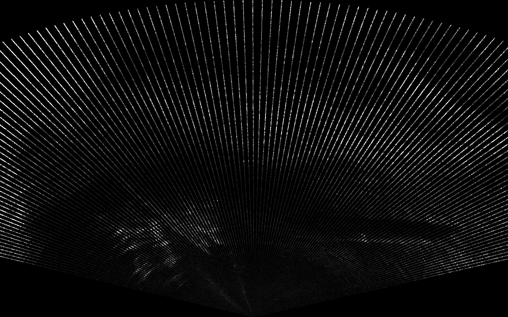

# gstsonar

GStreamer elements for processing sonar data from [Norbit WBMS FLS](https://norbit.com/subsea/products/).
Easily extentible to other sonars.



## Prerequisites

Ubuntu:

```
$ sudo apt-get install libgstreamer1.0-dev libgstreamer-plugins-base1.0-dev gstreamer1.0-plugins-good libsdl2-dev libglew-dev
$ sudo apt-get install curl zip unzip tar
```

Second line are requirements when using vcpkg as package manager.

Windows:

[GStreamer](https://gstreamer.freedesktop.org/download/)

[SDL2](https://buildbot.libsdl.org/sdl-builds/sdl-visualstudio-amd64/)

[GLEW](https://sourceforge.net/projects/glew/)

OpenGL (Preinstalled on Windows)

For Windows, you must also manually add the dll file directories of SDL2 and GLEW to the %PATH% environment variable.
Also, you must edit the paths to the libraries in CMakeLists.txt .
Not sure how to avoid all the manual configuration in Windows ¯\\_(ツ)_/¯.

## Build

```
mkdir build
cd build
cmake ..
make
```

## Install
```
make install
```


## Example launch lines

Note that you need to set `GST_PLUGIN_PATH=.` if running from build directory without installing the plugin.
Ie. `GST_PLUGIN_PATH=. gst-launch-1.0 ...`.
Extra debugging info can be printed with: `GST_DEBUG=2,sonarparse:9` etc.

View sonar data from file:

```
gst-launch-1.0 filesrc location=../samples/in.sbd ! sonarparse ! sonarsink zoom=5
```

View sonar data (multibeam/fls or bathymetry) from tcp:

```
gst-launch-1.0 tcpclientsrc host=192.168.3.58 port=2211 ! sonarparse ! sonarsink zoom=12
gst-launch-1.0 tcpclientsrc host=192.168.3.121 port=2210 ! sonarparse ! sonarsink zoom=.04
```


View sonar data from file as normal image (only for fls data):
```
gst-launch-1.0 filesrc location=../samples/in.sbd ! sonarparse ! sonarconvert ! videoconvert ! autovideosink
```

Parse both sonar and telemetry data:
```
SBD=../samples/in.sbd && GST_PLUGIN_PATH=. GST_DEBUG=2,sonardetect:9 gst-launch-1.0 filesrc location=$SBD ! sonarparse ! sonarmux name=mux ! sonardetect ! sonarsink filesrc location=$SBD ! nmeaparse ! eelnmeadec ! mux.
# (tee apparently doesn't go well with filesrc: gst-launch-1.0 filesrc location=../samples/in.sbd ! tee name=t ! queue ! sonarparse ! sonarsink t. ! queue ! nmeaparse ! eelnmeadec ! fakesink)
```

Parse sonar and telemetry data from tcp and apply detection:
```
GST_PLUGIN_PATH=. gst-launch-1.0 tcpclientsrc host=192.168.3.58 port=2211 ! sonarparse ! sonarmux name=mux ! sonardetect ! sonarsink tcpclientsrc host=192.168.3.100 port=11000 ! nmeaparse ! eelnmeadec ! mux.
```

Parse sonar and telemetry data from sbd file and save to another sbd file using sbdmux:
```
SBD=../samples/in.sbd && GST_PLUGIN_PATH=. GST_DEBUG=2,sbdmux:9 gst-launch-1.0 filesrc location=$SBD ! sonarparse ! sbdmux name=mux header=../NaviScan_iupo_eelume_MBE_3.BIN ! filesink location=out.sbd filesrc location=$SBD ! nmeaparse ! mux.
```

## Settings on norbit sonar

Connect to control interface:
```
nc 192.168.3.58 2209
```

Useful Commands:
```
set_power 1
set_flip 1
set_resolution 640 512
set_range 1 25
```
